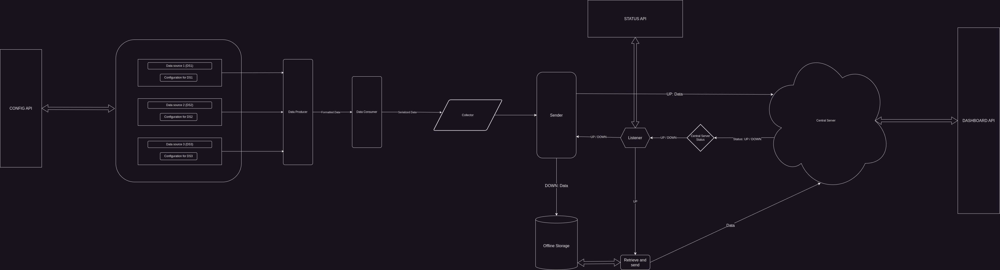

# Product Requirements README

## Table of Contents

1. [Problem Statement](#problem-statement)
2. [Goals and Objectives](#goals-and-objectives)
3. [User Type and Scenarios](#user-personas-and-scenarios)
4. [Functional Requirements](#functional-requirements)
5. [Non-functional Requirements](#non-functional-requirements)
6. [Visual Representations](#visual-representations)
7. [User Experience and Usability Plan](#user-experience-and-usability-plan)
8. [Technical Architecture and Choices](#technical-architecture-and-choices)
9. [Timeline](#timeline)
10. [Dependencies and Bottlenecks](#dependencies-and-bottlenecks)
11. [Testing and Quality Assurance](#testing-and-quality-assurance)
13. [User Documentation and Support](#user-documentation-and-support)
14. [Versioning](#versioning)
15. [Feasibility](#feasibility)
16. [Innovative Features](#innovative-features)
17. [Stakeholder Alignment](#stakeholder-alignment)
18. [Change Management](#change-management)
19. [Evaluation](#evaluation)

---

## Problem Statement

Gathering data from arbitrary log sources should not be a time-consuming task.
Blueteams, network admins, and anyone wanting to record and store the events 
of a service should have an efficient, secure method of doing so.

---

## Goals and Objectives

A stream of log events, provided by the client endpoint, will be packaged and
transported to a central cloud server for storage and retrieval. 

Whether on a windows or \*Nix-based endpoint, a user will be able to create an
account, receive proper credentials, and establish a secure connection between
the source of their logs and the central data-storage server.

Compatibility with ElasticSearch should be available to the user that will
complement the service the central storage server provides.

<a href="#table-of-contents" style="font-size: smaller;">back to top</a>

---

## User Type and Scenarios
| **User**           | **Scenario** | **Priority** |
|--------------------|--------------|--------------|
| *Security Analyst* | As a security analyst, I want to be able to specify relevant log sources for my investigations. |  High   |
| *IT Adminstrator*  | As an IT admin, I want an intuitive interface for configuring, initializing, and retrieving log data. | High | 
| *Network Administrator* | As a Network admin, I want the retrieval of network-related logs to be supported for network analysis. | High |

<a href="#table-of-contents" style="font-size: smaller;">back to top</a>

---

## Functional Requirements

1. **Data Collection:**
   - The system should be able to collect data from the specified source.
   - *Requirements:*
     - Use TLS certificates to connect to the data source securely.
     - Specify supported data formats for efficient data parsing.

2. **TLS Connection Establishment:**
   - The source should establish a TLS connection with the destination to ensure secure data transmission.
   - *Requirements:*
     - Implement TLS over TCP socket creation and management.
     - Create, Update, and Revoke certificates with an in-house CA manager

3. **Data Packaging and Serialization:**
   - The collected data should be packaged and serialized for transmission over the TCP connection.
   - *Requirements:*
     - Implement serialization and deserialization for efficient data transfer.

4. **Error Handling and Reliability:**
   - The system should handle errors gracefully and ensure reliable delivery of data even in the presence of network issues or packet loss.
   - *Requirements:*
     - Implement error detection and correction mechanisms.
     - Use TCP over TLS for retransmission of lost or corrupted data.
     - Implement system monitoring and alerting to reduce downtime during system degredation

5. **Destination Data Reception:**
   - The destination should be capable of receiving, processing, and storing the transmitted data.
   - *Requirements:*
     - Develop a system of database I/O.
     - Create a procedure to integrate with ElasticSearch.

<a href="#table-of-contents" style="font-size: smaller;">back to top</a>

---

## Non-functional Requirements
1. **Latency**
    - Response times should be less than 300ms
    - Support a 50% increase in log traffic
2. **Recovery**
    - Failure recovery without data loss
3. **Compatibility and Compliance**
    - WCAG compliant
    - Data protection compliant
    - Device and system agnostic (windows/\*nix)
4. **Documentation**
    - User and developer documentation
5. **Availability and Maintenance**
    - 24/7 avaiability, except during scheduled maintenance periods

<a href="#table-of-contents" style="font-size: smaller;">back to top</a>

---

## Visual Representations

<a href="#table-of-contents" style="font-size: smaller;">back to top</a>

---

## User Experience and Usability Plan

Lets take a user, A, who just attached a new service on their machine and wants
visibility on the data logs being generatad at a specific path. After creating
an account on the product website, the user installs the product onto their 
machine and supplies the credentials sent to them to establish a secure
connection with their personal server instance. When the user begins sending data
to the central server, their data is visible on their dashboard, streaming from
the central server.

We will make every attempt to ensure compatibility with users with disabilities
as the project progresses.

<a href="#table-of-contents" style="font-size: smaller;">back to top</a>

---

## Technical Architecture and Choices

The service running on the client machine will be written in Rust. The interface 
for client machines will be written using Tauri, another Rust-based project.

The reason for Rust being its ability to write and compile to multiple 
operating systems and handle threading and async operations. Along with its 
platform versatility, Rust's *cargo* command line tool has options for testing 
and documentation generation.

Tauri makes GUI creation simple. Given its cross-platform compatibility, due to
it being written in Rust, just makes sense.

The service running on the server will be a mix of languages, such as Terraform,
shell, Python, and Rust if needed. A relational database will be used, with
options left open to the user for integration with ElasticSearch if they choose.

The website providing the user signup, software distribution, and documentation
will use Svelte. 

<a href="#table-of-contents" style="font-size: smaller;">back to top</a>

---

## Timeline

A MVP of this service should be up and running at month 7. This will give 2
months for user testing.

<a href="#table-of-contents" style="font-size: smaller;">back to top</a>

---

## Dependencies and Bottlenecks

Still todo but: team size, creating the in-house CA, using Rust

<a href="#table-of-contents" style="font-size: smaller;">back to top</a>

---

## Testing and Quality Assurance

Between now and the 7th month, code and methods will be tested on a regular basis
as outlined in the SDP document [PROVIDE LINK TO SDP README].

### Test Conditions to be met:

#### API Repo:
**All api endpoints:**
1. Protect api endpoints through access verification

**Public Key Infrastructure api endpoint must handle the following:**
1. Issue certificates
2. Verify the identity of the requesting user requesting a digital signature 
3. Revoke certifcates of specific users
4. Renew certificates of specific users
5. Key Pair storage and retrieval
6. Certificate policy (cert lifetime, validation, key length reqs, etc.)
7. Follows industry standards (x509, bitlength, cipher type, etc.)
8. PKI audit logging
9. PKI heirarchy (masterkey -> prodkey1 -> [prodkey2, ..., prodkeyN])
10. Failure Recovery (offline masterkey) 

**User management api endpoints must handle the following:**
1. Create, Read, Update, and Delete users
2. Account management (signin/out/delete,cert retrieval/renewal, etc.)

**Dashboard api endpoints must handle the following:**
1. Data visualization 

**Software distribution api endpoints must handle the following:**
1. Provide links to download software for existing platforms

#### Frontend Repo:
1. Provide the interface to interact with the API
2. Device agnostic
3. Contains links to User and Developer documentation

#### Server Repo:
1. Create a TLS connection with Client
2. Create a database specific to the user
3. Eash user database has a table for each input log source
4. Delete database on user deletion
5. Automate the initialization of Server Instance

#### Client Repo:
1. Create a TLS connection with Server 
2. Command line and Graphical User Interface to configure:
    - the destination address
    - certificate (supplied from API repo)
    - path(s) to log source(s)

#### Documentation Repo:
1. Provides setup intructions for:
    - account managment
    - certificate management
    - client-server connection establishment
2. Establish a [Changelog](SUPPLY LINK TO CHANGELOG)

<a href="#table-of-contents" style="font-size: smaller;">back to top</a>

---

## User Documentation and Support
User documentation will be written to satisfy the requirements of the 
[documentation requirement section](#documentation-repo)

Support for this project will come as new maintainers are added to the
organization. Since this is an open-source project, forks will be possible under
the allowed [license](PROVIDE LINK TO SOFTWARE LICENSE).

<a href="#table-of-contents" style="font-size: smaller;">back to top</a>

---

## Versioning

- **Major**: breaking changes
- **Minor**: new features
- **Patch**: bug fixes

Stable versions will be available on the Minor versions. 

<a href="#table-of-contents" style="font-size: smaller;">back to top</a>

---

## Feasibility

<a href="#table-of-contents" style="font-size: smaller;">back to top</a>

---

## Innovative Features

<a href="#table-of-contents" style="font-size: smaller;">back to top</a>

---

## Stakeholder Alignment

<a href="#table-of-contents" style="font-size: smaller;">back to top</a>

---

## Change Management

Updates to software will be accompanied by a 
[Changelog](SUPPLY LINK TO CHANGELOG).

<a href="#table-of-contents" style="font-size: smaller;">back to top</a>

---

## Evaluation

<a href="#table-of-contents" style="font-size: smaller;">back to top</a>

